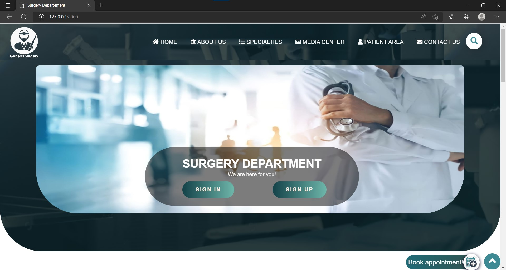
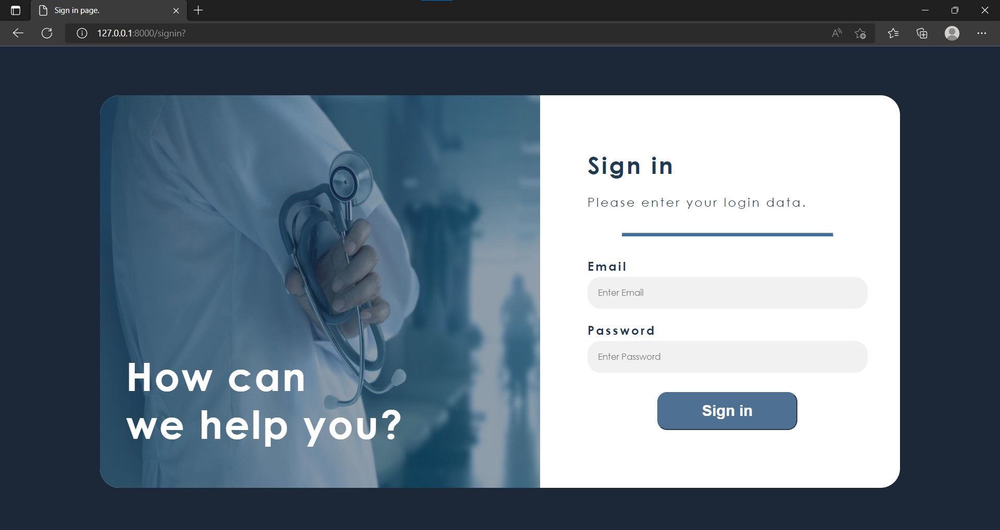
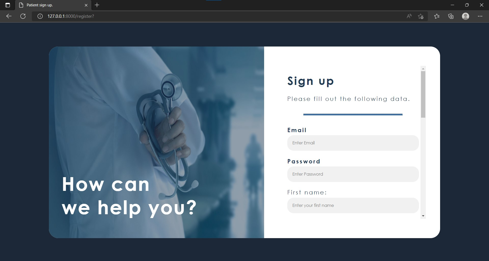

# Surgery department website by team 4
## How to start up the project:
*Use the following commands*
1. clone the repo\

git clone https://github.com/Esraa-alii/Surgery_departement_team4/tree/Final

2. install composer dependency

composer install

3. create an environment file

cp .env.example .env

4. set the Application key

php artisan key:generate

3. type the following commands in order:

cd backend/myapp\
php artisan migrate\
php artisan serve

the first command opens up the folder of interest, the second one migrates the database structures and the last one launches the server.

## Tools used:
for front end: HTML / CSS / BOOTSTRAP
for backend: Laravel (php)

## Project features:
### ER model

### Front end

- home page

this pages's features include:
  1. Sign up / sign in buttons
  2. previews of the different specialties of Surgery.
  3. Compaint box

- Sign in page

This sign in page is the universal page that all users use.

- Sign up page

This page is specific to patients, they're directed here if they try to book an appointment from the homepage.

### Back end features:
- When a patient books an appointment through their dashboard it appears at the doctor's dashboard, who can accept the appointment, then the admin will check the schedule for the rooms and specify the time and location of the operation

- Privilige validation when accessing routes
- Sign up / Sign in exceptions handled
- Statistical Analysis over the database appears at the admin dashboard
